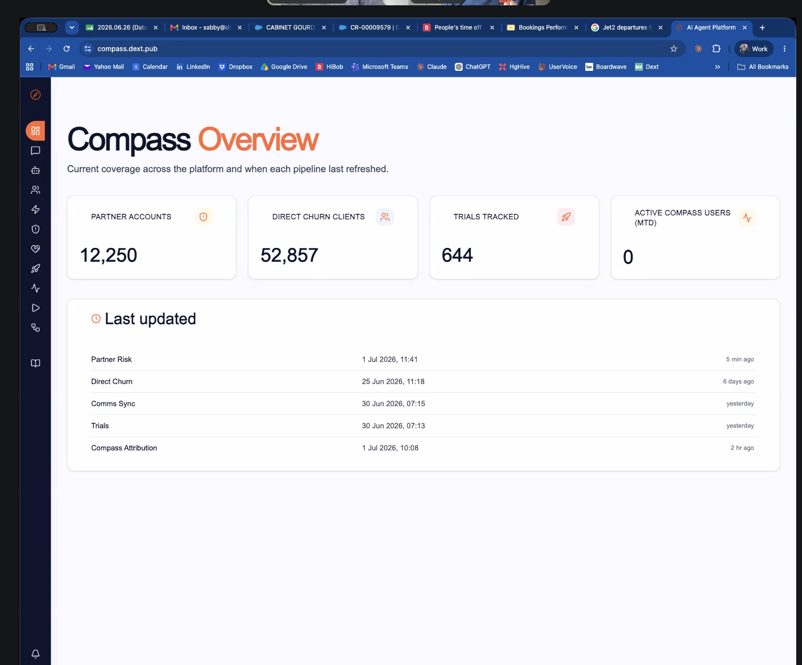
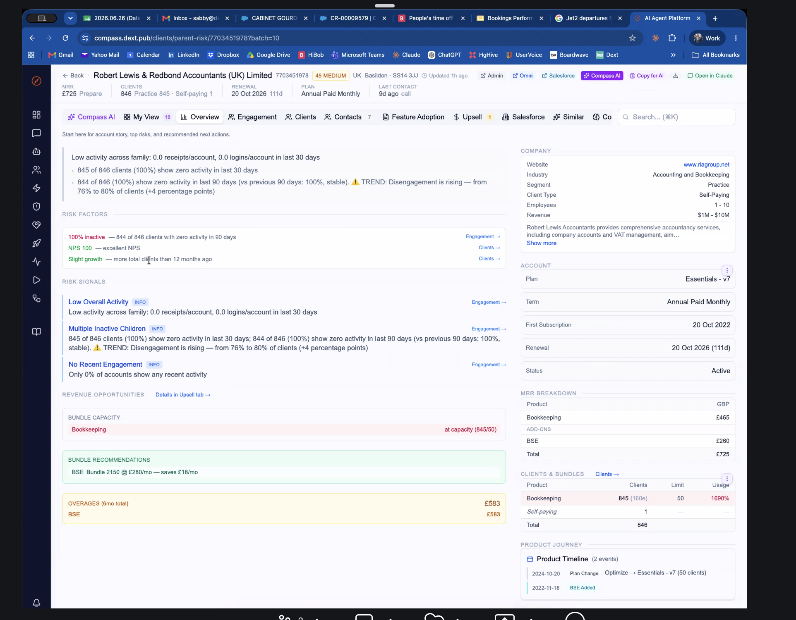

# Sabby Gill

## Meeting Details

- **Date:** Jul 1, 2026
- **Participants:** Brom Sulaiman, Sabby Gill
- **Meeting title:** Sabby<> Brom - Catch Up

## Snapshot

Sabby shared a highly practical operator and private-equity-backed SaaS perspective shaped by his time at Thomas and his current role at Dext under HG ownership. His main message was that product, technical architecture, churn risk, and AI readiness do matter in diligence, but the quality of that work varies significantly depending on the sophistication of the buyer and whether they have central operating teams or specialist support around them.

The strongest implication for us is that there is a credible opportunity to package product and telemetry-led diligence for software businesses, especially where buyers, PE firms, or acquisitive platforms do not have deep in-house capability. He also reinforced that the offer is likely to be strongest when aimed at tech-focused investors, SaaS consolidators, or larger platforms making repeat acquisitions rather than highly generalist investors.

## Who They Are / Relevant Context

- Former Thomas operator with direct exposure to both buy-side and sell-side deal processes.
- Now works at Dext and was involved in the acquisition process there, including product roadmap, diligence preparation, and investor conversations.
- Has first-hand experience of how a sophisticated PE owner such as HG uses central operating expertise during acquisitions.
- Particularly relevant because he has seen both what strong diligence support looks like and where smaller or less specialised buyers may have capability gaps.

## Key Commercial Insights

### 1. Sophisticated PE firms already operationalise specialist diligence

Sabby described how HG uses central teams across technology, value creation, and marketing operations, alongside external firms such as Arma Partners, to prepare businesses for sale and support acquisition processes. That suggests the top end of the market may already have structured support, but it also clarifies what "good" looks like for less sophisticated buyers.

### 2. The clearer commercial opening may be below the most mature PE houses

He suggested there is still room where buyers do not have the same centralised expertise or where acquisitions are too small to justify pulling in a full PE operating stack. That includes acquisitive software groups, PE-backed platforms doing smaller bolt-ons, and more financially oriented boutiques that need a specialist technical or product perspective added to the process.

### 3. Telemetry and behavioural signals can materially strengthen a diligence story

One of his most useful points was that churn risk, product engagement, and behavioural signals can be turned into a much stronger narrative for both buyers and sellers. Rather than relying only on backward-looking metrics, he showed how internal tooling can surface likely churn, disengagement, and upsell opportunity at account level, which is extremely powerful in an acquisition context.

### 4. AI readiness is becoming a core diligence question

He was clear that one of the first questions investors should now ask is whether a product has a defensible answer to AI. That includes whether the offer can be replicated cheaply, whether the codebase is modern enough, whether there is genuine product moat, and how exposed the company is to lower-cost new entrants using AI-native approaches.

### 5. A product diligence offer needs a clear technology thesis

Sabby pushed the idea that our offer will be stronger if it is explicitly built for software, SaaS, AI-driven products, and technology-heavy businesses rather than treated as a generic diligence service for any sector. He saw a meaningful difference between tech-focused investors such as HG and more opportunistic funds that own very mixed portfolios.

## How This Market Buys

- Larger and more sophisticated PE firms often buy this kind of support through internal operating teams, centre-of-excellence functions, and trusted specialist partners.
- More financially focused boutiques are likely to lead with valuation, comparables, EBITDA, and transaction structure, then pull in specialists when a technical or product issue needs deeper coverage.
- Bigger platform companies making their own acquisitions may buy external support directly when the deal is too small to justify using their PE owner's central resources.
- Demand is likely to be strongest when the offer is packaged as a practical diligence solution rather than an abstract product strategy exercise.
- The buyer needs to understand quickly whether the work helps them get a better price, avoid risk, or prepare a stronger sale narrative.

## Where Our Offer Fits

- Pre-acquisition: strong fit for product, architecture, AI-readiness, churn-risk, and telemetry-led reviews of software businesses.
- Sell-side preparation: clear fit where a business wants to prepare stronger materials, anticipate buyer questions, and evidence product quality before a process starts.
- Buy-side support: useful for PE firms, acquisitive SaaS groups, or M&A advisers who need deeper product and technical interpretation.
- Post-acquisition: still relevant where buyers need a view on retention, product roadmap, modernisation, and value-creation priorities after a deal closes.
- Smaller bolt-ons: likely a particularly practical entry point where central PE resources are too expensive or too stretched to get involved.

## Diligence / Value Creation Priorities

- Technical debt, architecture quality, roadmap credibility, security issues, and product reliability are recurring diligence themes.
- Buyers increasingly need to understand churn risk, contraction risk, product engagement, and whether revenue quality is genuinely durable.
- Key questions include whether the product has a credible moat, whether AI weakens the value proposition, and whether the company can explain its future defensibility.
- In SaaS, table-stakes operational measures such as uptime, accuracy, and service reliability can materially affect buyer confidence.
- A product or codebase that is overly dependent on legacy architecture, dated technology, or easily replicated workflows is a significant risk.

Sabby shared two screenshots from Dext's internal `Compass` tooling to illustrate what stronger telemetry-led diligence can look like in practice.

This view shows a top-level operational dashboard across partner accounts, direct churn clients, trials tracked, and data refresh timestamps. The important signal is not the absolute figures, but the fact that a live system exists to monitor account risk and keep diligence-relevant data current.

This account-level example shows how risk factors and signals can be translated into something commercially useful: inactivity flags, disengagement trend, renewal timing, bundle capacity, overages, and upsell recommendations. It is a good illustration of the kind of evidence a buyer or seller would want when assessing retention quality and expansion potential.

## Positioning And Messaging Implications

- Position the offer around software, SaaS, product, platform, and AI-readiness diligence rather than broad "strategy" language.
- Lead with practical buyer outcomes such as avoiding hidden product risk, supporting price negotiations, strengthening sell-side preparation, or improving confidence in retention quality.
- Be clear that this can work for both sides of a deal: preparing a business for scrutiny and helping a buyer interrogate what they are acquiring.
- Avoid implying that all PE firms have the same needs, because the sophistication gap between operators such as HG and more generalist funds is material.
- Consider whether the offer should lean into a specific thesis around telemetry, retention risk, and modern product defensibility rather than generic product review.

## GTM / Relationship Strategy

- A useful route in may be tech-focused PE firms, acquisitive software groups, or PE-backed platforms doing repeat bolt-on deals.
- Lower and mid-market M&A boutiques may also be useful if they want a specialist partner to cover technical and product diligence gaps.
- Sector focus matters: the proposition appears strongest for software, SaaS, AI, fintech, HR tech, and adjacent digital products rather than broad industrial or mixed portfolios.
- Parliament may be a helpful conversation because it sits below the most operationally mature end of PE while still having relevant exposure.
- Sabby also noted that some buyers will only value the offer if we make the commercial outcome obvious: better diligence, better preparation, better pricing leverage, or lower risk.

## Commercial Model Considerations

- The offer could be packaged as a turnkey diligence solution, a specialist advisory module inside a broader transaction process, or a sell-side preparation engagement.
- There is likely to be value in serving both PE firms and acquisitive software businesses, but the messaging may need to differ by audience.
- The commercial case is strongest where the acquisition is too small for a full PE operating team to engage, but still large enough that product and technical diligence matter.
- A reusable playbook, scorecard, or assessment framework could help make the offer easier to buy.
- There may be scope to combine consulting with lightweight tooling or structured data collection over time.

## Risks / Challenges

- Targeting the most sophisticated PE firms first may be difficult because many already have internal operating teams and established advisers.
- Going too broad across all sectors could weaken the offer if the real advantage is in software and technology-heavy businesses.
- A generic "product strategy" pitch may undersell the diligence, valuation-protection, and AI-risk angles that buyers care about.
- If the offer cannot speak credibly to AI disruption and codebase modernity, it may miss one of the most urgent diligence themes.
- Some investor groups may care far less about this work if they are buying non-technology businesses where product and platform quality are not central value drivers.

## Suggested People To Speak To

- No specific individual names were suggested for outreach in the conversation.
- Sabby offered to help with introductions in M&A and suggested Parliament as a potentially relevant organisation to test the proposition with.

## Takeaways For Us

- There is a credible PE-adjacent opportunity, but it is likely strongest below the very top tier of PE sophistication or inside repeat-acquisition software groups.
- The proposition should probably be framed around software diligence, retention quality, technical risk, and AI defensibility rather than broad product strategy.
- Telemetry-led evidence is a strong differentiator and could become a distinctive part of the offer.
- Sell-side preparation may be as important as buy-side diligence, especially where businesses need help surfacing strengths and pre-empting scrutiny.
- We should test the offer first with tech-focused investors, acquisitive SaaS businesses, and selected M&A boutiques rather than assuming one PE message fits all.

## Full Transcript

Meeting Title: Sabby<> Brom - Catch Up
Date: Jul 1, 2026
Meeting participants: Brom Sulaiman, Sabby

Transcript:
 
Them: Recording in progress. Hey bro.  
Me: Hey, sabby, how's it going?  
Them: Ther very well sorry about that I don't know why.  
Me: That's right. It happened.  
Them: Sitting here.  
Me: Yeah. The heat has been fun. I think. I'm quite enjoying this respite week. Of lack of absolute lack of sleep. But I think next week it picks up again, doesn't it? Yeah.  
Them: This weekend. Yeah out all the weekends it's like. This one it's the biggest sporting weekend in the uk as well right tennis. You got the football and then there's some horse racing going on I think I'm not. Sure if there is a formula one going on well formula one obviously would Grand Prix yeah be interesting. With this sort of weather coming on.  
Me: Gotta be careful.  
Them: As well.  
Me: The what? Sorry.  
Them: The henry regetta.  
Me: Oh, of course. Are you going this year?  
Them: No but my station is twyford which is where everybody comes into.  
Me: Yeah.  
Them: Before all the way back up to ship lake and marlo and all of that henley stuff.  
Me: Yeah. Busy time, isn't it? How's things been with you? It's been. How long ago was it? You were at Thomas now? I can't.  
Them: Yeah probably what four years ago five years ago yeah.  
Me: Wow.  
Them: Two years and then join. The company I'm at the moment decks and then of the business.  
Me: Yeah.  
Them: In december 18 months ago December 24.  
Me: Yeah.  
Them: Things that you were writing. Absolutely you know we did everything right we had vcps. In the first 18 months before the acquisition. You've got I was involved in all of the buy side sell side conversations discussions all the fireside chats we had eight different organizations that are chasing us at the same time.  
Me: Wow. Wow.  
Them: That we had to do around product roadmaps and all of that type of stuff yeah I was involved in all of those discussions I was interested in.  
Me: Yeah.  
Them: Sharing whatever I can from that perspective.  
Me: Yeah. Nice. That's really, really kind. I think. I went independent last year, so I left Thomas after seven years. Probably a few too long. I think I was a bit disillusioned by the end. But that's another story. But I'm seeing.  
Them: Wow.  
Me: And. Have mainly found work with clients portfolio companies of PE and have seen some opportunities there. I kind of fell into them via network, really, but I've seen opportunities. You know, the due diligence side of things from a product strategy. And, you know, perspective, I just wanted to run that by. I think is that bad? Is that. Does that exist? Does, you know, is there a root to that that's achievable? You know, no idea.  
Them: It's definitely. Something I think some people do it really well right the bit that I think most places do it well is when you're if you've got a very established well-run P house right so we're part of hg capital. So with someone like hg right they have their model is slightly different so what they have is they have centers of excellence and a sense of experts so. On on our board we had two people from. We had two people from hg we had some insight. Partners were also part of the holding of dext then we had independent board members but because we predominantly owned by hg. They would they got centralized teams so they have a central CTO function there was control vcp function. Of essential marketing ops right team then basically when you know that you are running up to an acquisition and then we also worked with a company called armor partners. So armor is a it's almost like an investment bank right type middle person that basically. Brokers deals has all the connections and then helps you put together and coaches you through all of the conversations that you were going to have help with technical briefings of these are things that we know that they will cover right and then normal you know due diligence type here's all things we want to cover and it's normally the same stuff all the time right tell us about technical debt tell us about architecture tell us about your roadmap give us by product by revenue by bookings historical stuff things like security vulnerabilities right they'll do a full rubber glove on you.  
Me: Yeah. Yeah.  
Them: Now the good thing was that's where hg really came to. The light because they would then come in and say right guys. Almost three or four months beforehand these are the things you need to be able to create and prepare from a pitch deck perspective around technical architecture and that sort of stuff. So if we hadn't had somebody like that who do this day in day out by companies sell companies know what good looks like and it got years of experience that's where I think. We had the benefit there's probably other pe houses that aren't as good as it and it. So coming up with a tool that you can and I think the best place to sell it is actually to the peas. And say look here's a turnkey solution that you can whether it's a consulting gig or whatever if you've got a. If you're looking to do an acquisition here's what we can come in and do for you and basically you know whether it's not whether it's preparing for sale we can help you prepare all of the required content or if it's on the other side where you're looking to buy somebody we can help you through that due diligence by looking you know he's a playbook of information data insights that we can give you. I think that that's going to always going to be your best bet is almost like get to. Get to the organ grinder right who's really who's making all of these deals happen. Or it's going to be going to a big organization right as an independent for example a Visma right isn't a perfect one an access group. Actually both of which are owned by HG.  
Me: Okay.  
Them: I also owned by each she as well where these really large organizations do their own mini acquisitions right smaller players so they won't necessarily bring in HG for every single one of them but they got to be fairly independent because there's always a ticket price from hg or from any PE to use their resources on any of due diligence now depending on how big the acquisition is that.  
Me: Yeah.  
Them: May vary. Like they may say well that's too small for us to get involved in. But big acquisition like Dex was a big acquisition it's the largest acquisition ever done for Iris.  
Me: Yeah.  
Them: That's when. HG got involved. Now HG were interesting enough on the buy side and the sell side and they had Chinese wars between both of them. Because obviously they didn't want. Everybody's acting on different parts of the business but even though you know I'm sure they probably shared information in corridors but didn't necessarily make anybody aware of that. So that would be my first initial piece as I was thinking about some of the things that you're referring to and and pulling together. Is whatever you do you really want to try and get in with some of those types of organizations.  
Me: And there are different levels to those, like, imagine HG is quite a pretty big player in the space. Like pwc, Etc. I've spoken to a few people and they've mentioned things like lower end kind of m a boutiques. I don't know much about that space either, which might be easier to get into to start with. I don't know if you've had any experience with, with them.  
Them: Yeah the thing about obviously the boutiques they they tend to work more on the financials right enterprise value here's how much we think you're going to be worth. Here are some.  
Me: Yeah.  
Them: Comparable comps from other acquisitions done at the same level with similar rule of 40 bit da that sort of stuff here's what we think we can get for you.  
Me: Okay.  
Them: Right but then the but the skill set they won't have is that they won't go deep. Into any particular like they won't do like we're boutique for technical advance that that's where I can understand why people would say actually if you can get in with the with them as they go in acquisition and they see a need then it's easier to pull input people and say well actually we feel this one.  
Me: Yeah.  
Them: That putting in a third party who can come in and help you through that due diligence on the technical piece is absolutely the right thing to do. Yeah perfect another perfect one is actually Parliament. Right so if you.  
Me: What did they sit? Were they. I was never quite sure how. How big were they kind of mid, weren't they?  
Them: Re not I wouldn't say they were massive right when they owned Thomas and they're still holding on to them.  
Me: Yep.  
Them: If you you know but the challenge with them is that they had. It depends on where you're concentrating is we were the only tech company they had we were the only SaaS company they had a rug company they had a sock company they had a foreign exchange company and what you're offering won't necessarily work for all of those different industries so if it is very tech focused software focused you know client server SaaS models technology AI driven.  
Me: Wow.  
Them: Tech stacks. Then it's a very different niche and that's when a HG or something like that. Potentially would work or a kkr acceler or any of those whereas you know Parliament was such a general opportunistic you know what we see an opportunity there. Let's go for it I think that. S that's the difference that you're probably going to have to think about on what you need to be able to. Create your niche on are we specialists in certain areas? Or we just generalists that give offer this to doesn't matter how what type of. Technology or retail or industry you're in we can offer you a solution. Because sometimes that is the opportunity as well. Because that especially with the advancement of technology and everybody sort of moving on that is probably something you look at and sort of say well actually you know what we do need to do this but we've never really thought about doing it and actually you might give somebody. The ability to actually. Do. Get a higher price. Because now they're showing some sort of moat that would never really obvious right around things like you know we talk in our business we talk about accuracy 99.9% level accuracy we talk about nine yeah we had 25 minutes worth of downtime last year in the entire system so it goes back to reliability and those sort of things sometimes that never comes out into due diligence until somebody turns around and asks the right questions sometimes it's a given but that's almost a table shapes in a SaaS environment whereas in another type of like you know if you think about a sock company like it probably isn't important if the system goes down for a week goes down for two weeks yeah you might lose a little bit of production you might lose a bit of retail but it's not critical like in financial world where if your system's down you can't close your books we had this exact example zero one of the.  
Me: Yeah. Yeah.  
Them: Software companies obviously you know down in Australia and New Zealand. They yeah so literally in the week of. The financial closing in Australia their system went down and they then had to go back to the government back to the ATO basically say look systems have gone down infrastructure was not reliable we blame us but but that was a perfect example of where things just. Do go wrong.  
Me: No, that's fascinating. Yeah. Yeah. I enjoy zero, but, yeah, I can see how if that goes down, that's a big problem for a lot of people. And so just back to your experience with HD. Did. I know that they, they measure different facets of, like, you know, the, the deal. To, so from financial, legal, commercial, is there ever a product strategy specific? I know you mentioned roadmaps and things like that, but analyzing the product itself, you know, whether there's churn risk, retention problems, any of those sorts of things. Is that something that happens?  
Them: Yeah they do do it but they but and different organizations have different mechanisms right and I think with AI now it actually makes it even easier. Right to do that analysis. So I'll give you an example let me just. What we've what we've developed internally. Something we put pull together got three. AI developers who literally did exactly what you were talking about which is okay. What's the next what what's our risk churn what's a GRR issue you know when you think about. Contraction people are likely to leave people who likely to churn.  
Me: Yeah.  
Them: They always end up being very historical numbers right backward looking but really what you want is you want the ability to stand in front of a potential acquirer and investor to be able to turn around and say look we look at every single signal in the system what's going on behavioral.  
Me: Yeah.  
Them: Signals of how customers are behaving in the system and in the product to then identify whether or not there's an opportunity and whether there's a risk or whether there's a churn that's a massive focus you've got people like gainsight who do that for a living and this is what we pull together so I'll give you a perfect example here so if I bring up a so partners here are things that people like imagine accountants and bookkeepers right so here's a list of every single accountant at bookkeeper in the entire system we've got. Clear all filters first. So it's clear all filters so I had 12,250 partners right Canton's bookkeepers globally that I deal with I've got every single one of them recorded but I you know we are we look at things like show me. Behavioral risk that this is what are they doing from a behavior perspective so that shows that these people are potentially at risk so excellent MPS so really really happy with the product haven't shown much growth. They've got 844 of their clients with zero activity in the last 90 days not surprisingly because tax return was only done in April and we're now sitting in first of July so April May June three months ago they probably would have done it in March. So. Even though. It's giving me these signals it's not actually. There's nothing I need to do on this particular one right so if I just go just go back but just being able to identify look here's a potential upsell is a potential risk what is that risk just identifying what that sort of looks like tells you who it is and I can just keep on you know if you do any search criteria on individuals people you know one of my top salesperson in the UK Amina right here's a high highly identified risk of this particular account that is more than likely going to churn for these particular reasons. So I like when I came on we didn't have anything like this right so I hired two AI specialists and said right guys here's your challenge I want you to give me all of the behavioral signals all of the telemetry everything in the product that basically turns around and tells me who is the next likely person that is going to churn is going to downsell and then this is this is invaluable right if I can go to I'm going through a. Acquisition right and somebody's just about and they start I can just bring this up and just say right what do you want to know I got all the signals all the identifiers everybody that's going to tell me so yes I believe going back to just let me just stop sharing but hopefully give to give you a sense of something like that is something that is extremely valuable but hard does it.  
Me: That's fascinating. Yeah. Because I can see how valuable that is to you as an organization, but also to just communicate if you ever need to.  
Them: Yeah.  
Me: To other organizations that may be interested in purchasing. Yeah. And that's not done, do you say? It's just not.  
Them: Not done by anybody if you don't speak to anybody and say any organization you speak to and say look what's your biggest challenge? Right what is your gr right which your gross retention rate.  
Me: Yeah.  
Them: And that's basically you know if you take all your churn contraction people are leaving you and everything else set your marker 100 normally good is anything above 90. But when you're in an SMB world selling directly to businesses that can just make that decision straight away.  
Me: Yeah.  
Them: It tends to be a lot lower. They think about commerce right it was quite easy to literally stop using Thomas one day and moving to another application so then likely to churn you think of an SAP it's very difficult to turn around and say I'm going to stop using sap today and use the next week tomorrow so that's the reason why gr tends to be a lot higher in enterprise world larger organizations than smaller organizations that tend to be a lot. More fluid in relation to their choices and what they do and how they do it.  
Me: No, that's fascinating. I think, you know, I can see that working for both sides as well. I think you mentioned it before the buyer and the seller. Because you. As a buyer, you want to see the Telemetry and everything else. And then as a seller, you want to understand it so you can improve it. So it makes it more appealing. Okay. Fascinating. It blows my mind that that's not a thing that's done, I think, because I'm working in the sme Market at the minute. I don't expect to see that stuff, but I thought at the higher level there would be, which is.  
Them: Yeah no even in the SME world right it's even more important than the sme world because you know in the SME world that go are level ends up being close to 80 to 90. The antibiotic 90 to 100 so you're more than likely going to be losing a lot more customers during that first because they can it's choice right they pay monthly right and go back to the sme world thinking Thomas is an sme right is how easy is it for. One of their customers to say I'm going to stop using you today?  
Me: Yeah. Yeah.  
Them: Somebody's offering a lower price and they will go for a price per unit perspective where they'll turn around and say well actually it's cheaper. I got a competitor who's offering something very similar. In relation to psychometric. Testing and by the way they're five times cheaper than you are new you think about it a new entrance today.  
Me: Yeah.  
Them: Right and I think this is Thomas's biggest challenge going to be in I can take a CV. Put it straight into claud or something like that and I do this today and put it against a job description and say show me the fit of this individual against it now of course it doesn't know behavior or any of that type of stuff. But it will tell you what are the questions I should be asking for this type of role. To check to check personality behavior traits and all of the things what is an ideal role look like. They'll be able to come up and say sambi just ask these 10 15 questions.  
Me: Yeah. I mean. Yeah, you're right. All the IP of Thomas, it's, it just knows it. It's.  
Them: It knows it but also then what I do is I then take a recording. Of that right take all the notes and the transcripts load it back in again and say here's the here's the result of the conversation I had I asked all the questions now give me another.  
Me: Yeah. Yeah.  
Them: Readout or whether or not and how suitable this person is and you do that across 10 different candidates and then you throw it all back in again and say right now do a comparison of all of these 10 candidates for the who should I take forward to the second round etc so all of a sudden yeah that value proposition that thomas used to have is very is diminished.  
Me: Yeah. Yeah.  
Them: And I think that's just going to continue depending on which industry vertical that you start looking at right from a use case perspective.  
Me: Definitely, definitely. I, you know, yeah. I mean, the writing was on the wall at Thomas for a while. And that was why they tried to Pivot into the new category. I don't know how that's going.  
Them: The problem is the category they've moved into is actually even more. I would say is even more AI prone.  
Me: Yeah.  
Them: Right if you've got data right that's that's what we always talk about is if you've got context and it's not going to take long to you know for these AI for people to be able to take all of these different.  
Me: Yeah.  
Them: Previous psychometric tests loaded them up. And use that as your llm right that's my test database of all of these. People and if you're a recruitment company which is our primary. Right use case when we're at tum. Mit they've got they've probably got more cv he's more more data on feedback and portals that you just put an M over.  
Me: Yep. Yeah.  
Them: And now all of a sudden it's like well actually do we need to go into a psychometric test why don't we just create our own?  
Me: Yeah. And you could do it in five minutes as well. And that can be bespoke per candidate if you need them. It's, it's.  
Them: Correct. Yeah and per candidate cultural differences region role specific I was actually on a I was actually speaking to the one of the partners at Russell Reynolds because we were using them at the moment just on some of my senior appointments and I was talking to them about this and they said that's exactly what we do. Right they they. Built something they don't use any psychometrics they created their own bespoke per vertical per role that really nails it down and also you know that whatever you build in Thomas. Right it's not it's so generic. That if if you had someone like you know IBM. You had a compact you had an HP you had five different. Every single one of them behaviors roles traits are completely different so only one tool ever be able to meet those so bespoke AI is as you know right AI going to change the game on all of that stuff.  
Me: Yeah. Yeah. It's, it's a shame. But I think, yeah, Thomas. Is, is going to struggle, I think. Yeah.  
Them: Speak to a number then they still reach out I've got a I'm actually catching up with Jillian over the next couple of weeks.  
Me: Amazing. She's, she's still there then.  
Them: Yeah she's still there gonna pop out for lunch and then spoke to tim a couple of times.  
Me: Yeah.  
Them: I've been coaching and helping support Mentor Joe.  
Me: Jo. Oh, cool. Because he's CEO now, isn't he?  
Them: Now he's the CEO of expense product and actually very similar to us but he starting his journey in the p world hasn't done anything yet so he's asking.  
Me: Yeah. Yeah.  
Them: You know what's it like and approaches so we catch up on a fairly basis and see if I can help him out.  
Me: Oh, that's great.  
Them: And.  
Me: I spoke to guy recently as well because he's in a similar kind of PE world. And he's doing well. Really got a lot of time.  
Them: All the time and the things that he was doing I saw post with him and Serena Williams or something on a post recently or something. So yeah.  
Me: I really appreciate where of time, so I don't want to hold you up. Really appreciate this, Sabi. It's probably the best conversation I've had about this stuff so far. So we sp.  
Them: Yeah. Well look if anything else crops up or if there is anything else I can do and I'm happy to do a few intros right however m a for example here.  
Me: In. Yeah.  
Them: And also you know we've got a head of product right Chris but most of the to be honest most of it we're not doing Acquisitions at the moment what they're doing is they're probably doing more divestitures.  
Me: Yeah.  
Them: But we get the benefit of HG right I think I think one that's probably worth speaking to is Parliament.  
Me: Okay. Okay. I know a couple of the guys there.  
Them: Right. Yeah and just say that I'm thinking of doing this yeah two things one is.  
Me: So.  
Them: Help them in relation to their due diligence seven companies Tech stacks those sort of things and it's probably even more important the number one thing I would say that everybody needs to be wary of almost from day one is have an answer to AI from the beginning. And in order to do that you got to be able to say well okay watching mode and anybody replicate this can I replace it but there's also the how old is your code.  
Me: Yeah, yeah. Yeah.  
Them: Right desktop have you been client server have you moved through all of this and that everything that's very prevalent of some of the stuff that we're seeing is that especially when you've got people like zero QBO and everybody else new ancients are literally popping up saying replace all of that one man who literally will turn around and say well actually we can go ahead and do all of that and by the way I can do it a tenth of the price and people.  
Me: Yeah. Yeah.  
Them: Those small smes you refer to. Very very price conscious.  
Me: Yeah.  
Them: Have you showed them you can do something at a tenth of the cost and it pretty much does what you said it was going to do. They'll swe. Ar they got loyalties it's all about price for them.  
Me: Yeah. Okay. That's really useful. If I put together my thoughts on this are evolving put together some sort of one pager and just if you could have.  
Them: More than happy to do any reviews or anything else I can help with just by all means reach out.  
Me: Yeah. Fantastic. And if you ever need anything from my world, give me a shout. Really appreciate. It. Thank you.  
Them: Yeah thanks all mate take  
